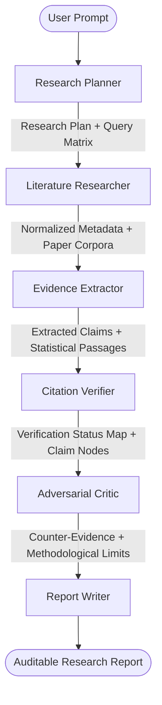
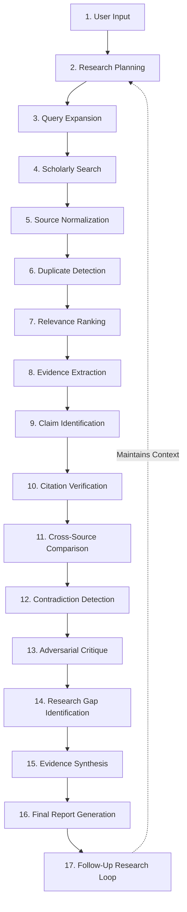
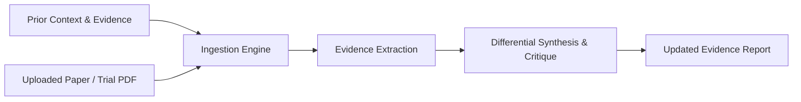

<div align="center">

# 🔬 LUMINAR AI
### Autonomous Multi-Agent Research Intelligence Platform

*“Plan → Search → Extract → Verify → Critique → Synthesize → Cite → Audit → Continue”*

[](https://opensource.org/licenses/MIT)
[](#-system-architecture)
[](#-citation-verification-framework)
[](#-external-data-providers--fault-tolerance)

<p align="center">
  <b>Luminar AI turns complex, fragmented scientific exploration into a verifiable, deterministic, and auditable multi-agent workflow.</b>
</p>

</div>

---

## 📌 Table of Contents

- [Project Overview](#-1-project-overview)
- [Problem Statement](#-2-problem-statement)
- [The Solution](#-3-the-solution)
- [The 6 Specialized Agents](#-4-the-6-specialized-agents)
- [Multi-Agent Collaboration Model](#-5-multi-agent-collaboration-model)
- [Complete 17-Step Research Workflow](#-6-complete-17-step-research-workflow)
- [Persistent Research Engine](#-7-persistent-research-engine)
- [Iterative Evidence Ingestion](#-8-iterative-evidence-ingestion-new-paper--existing-research)
- [Document Intelligence](#-9-document-intelligence)
- [Scientific Image & Multimodal Understanding](#-10-scientific-image--multimodal-understanding)
- [Research History Workspace](#-11-research-history-workspace)
- [Source Management & Grounding](#-12-source-management--grounding)
- [Auditability & Traceability](#-13-auditability--traceability)
- [Trust & Research Integrity](#-14-trust--research-integrity)
- [Hallucination Resistance](#-15-hallucination-resistance)
- [Contradiction Detection Engine](#-16-contradiction-detection-engine)
- [Research Accuracy & Benchmarking](#-17-research-accuracy--benchmarking)
- [Telemetry & Cost Tracking](#-18-telemetry--cost-tracking)
- [External Providers & Fault Tolerance](#-19-external-providers--fault-tolerance)
- [User Experience & Live Progress States](#-20-user-experience--live-progress-states)
- [System Architecture](#-21-system-architecture)
- [Technology Stack](#-22-technology-stack)
- [Security, Privacy & Safety](#-23-security-privacy--safety)
- [End-to-End Walkthrough](#-24-end-to-end-walkthrough)
- [Feature-to-Problem Mapping](#-25-feature-to-problem-mapping)
- [Paradigm Comparison](#-26-paradigm-comparison)
- [Core Demo Highlights](#-27-core-demo-highlights)
- [Expected Impact](#-28-expected-impact)
- [Quickstart Guide](#-quickstart-guide)

---

## 🔬 1. Project Overview

Luminar AI is an AI-powered research intelligence platform designed to help researchers conduct academic and scientific investigations in a faster, structured, evidence-grounded, and fully auditable manner.

Instead of relying on a single, monolithic AI chatbot to find papers and generate answers, Luminar AI distributes the research lifecycle across specialized autonomous agents. Each agent executes a dedicated research stage and passes structured, typed state to subsequent agents.


```

Research Question ──▶ Research Planning ──▶ Literature Discovery ──▶ Evidence Extraction
│
Research Report ◀── Evidence Synthesis ◀── Adversarial Critique ◀── Citation Verification
│
└──▶ Continuous / Follow-Up Research Loop

```

---

## ⚠️ 2. Problem Statement

Academic and scientific research is slow, manual, and scattered across disparate sources:

* **Fragmented Tooling:** Researchers manually query multiple databases, reconcile formats, and manage dozens of open browser tabs.
* **Manual Bottlenecks:** Information extraction, cross-study synthesis, and methodology comparisons consume hundreds of manual hours.
* **AI Hallucinations:** Traditional chatbots invent citations, mix up DOIs, misattribute findings, and state ungrounded claims with high confidence.
* **Overlooked Discrepancies:** Monolithic LLMs often force artificial consensus rather than highlighting conflicting results or small sample sizes.
* **Context Loss:** Research sessions reset with every new prompt, making long-term investigation impossible.


```

Traditional AI:  [User Question] ──────▶ [Monolithic LLM] ──────▶ [Plausible, Unverified Answer]

```

---

## 💡 3. The Solution

Luminar AI transforms scientific research into a coordinated, multi-agent pipeline. The platform replaces single-prompt answering with a verifiable research workflow:

* **Evidence-Grounded:** Every conclusion maps directly to verified textual passages.
* **Source-Aware:** Distinguishes full-text, abstract-only, and metadata-only evidence.
* **Citation-Aware:** Real-time validation of DOIs, authors, and source integrity.
* **Adversarial:** Proactively seeks out counter-evidence and methodological flaws.
* **Traceable & Auditable:** Preserves an inspection trail from initial query to final synthesis.
* **Persistent:** Retains past findings, query strategies, and documents across sessions.

---

## 🤖 4. The 6 Specialized Agents


```

┌──────────────────┐      ┌───────────────────────┐      ┌─────────────────────┐
│ 1. Planner Agent │ ───▶ │ 2. Literature Agent   │ ───▶ │ 3. Evidence Agent   │
└──────────────────┘      └───────────────────────┘      └─────────────────────┘
│
┌──────────────────┐      ┌───────────────────────┐      ┌──────────▼──────────┐
│ 6. Report Writer │ ◀─── │ 5. Adversarial Critic │ ◀─── │ 4. Citation Verifier│
└──────────────────┘      └───────────────────────┘      └─────────────────────┘

```

### ① Research Planner Agent
Deconstructs research questions into structured execution strategies using the **PICO** framework (Population, Intervention, Comparison, Outcomes) and boundary conditions.
* Identifies inclusion and exclusion criteria.
* Breaks complex topics into targeted sub-questions.
* Expands single queries into multi-angle search strings.

### ② Literature Research Agent
Asynchronously queries academic repositories, preprint servers, and scholarly databases.
* Connects to Crossref, Semantic Scholar, PubMed, arXiv, OpenAlex, Europe PMC, and IEEE Xplore.
* Extracts structured metadata: titles, authors, DOIs, publication years, abstracts, and open-access URLs.

### ③ Evidence Extraction Agent
Reads ingested literature and user-uploaded files to extract discrete empirical data points.
* Identifies methodology, sample sizes ($N$), populations, statistical indicators ($p$-values, effect sizes), limitations, and direct quotes.
* Categorizes evidence tier: **Full-Text Evidence**, **Abstract Evidence**, **Metadata-Only**, or **User Document Evidence**.

### ④ Citation Verification Agent
Evaluates claims against source text to prevent hallucinations and misattributions.
* Connects claims directly to primary sources: $\text{Claim} \rightarrow \text{Evidence} \rightarrow \text{Source} \rightarrow \text{Verification}$.
* Assigns granular verification statuses:
  * 🟢 **SUPPORTED**
  * 🟡 **PARTIALLY SUPPORTED**
  * 🔴 **CONTRADICTED**
  * ⚠️ **UNSUPPORTED**
  * ❓ **SOURCE NOT FOUND**

### ⑤ Adversarial Research Critic
Stress-tests emerging conclusions by proactively hunting for contradictions and methodological limitations.
* Evaluates confounding factors, small sample sizes, and correlation vs. causation errors.
* Replaces artificial consensus with explicit **“MIXED EVIDENCE”** summaries when data conflicts.

### ⑥ Research Report Writer
Synthesizes verified data points into comprehensive literature reviews and reports.
* Formats executive summaries, methodologies, key findings, counter-evidence tables, research gap analyses, and verified reference lists.

---

## 🔗 5. Multi-Agent Collaboration Model

Agents do not operate as isolated chat sessions; they share and mutate a typed, unified state object across the entire lifecycle:



---

## ⚡ 6. Complete 17-Step Research Workflow



1. **User Input:** Researcher inputs primary question or upload.
2. **Research Planning:** Formulates boundaries, PICO criteria, and scopes.
3. **Query Expansion:** Generates variations to capture adjacent literature.
4. **Scholarly Search:** Dispatches API requests across connected research databases.
5. **Source Normalization:** Formats varied provider outputs into a unified schema.
6. **Duplicate Detection:** Removes duplicate records via DOI and normalized title matching.
7. **Relevance Ranking:** Scores papers by semantic similarity, population match, and recency.
8. **Evidence Extraction:** Extracts data points, experimental methods, and key quotes.
9. **Claim Identification:** Isolates assertions for systematic verification.
10. **Citation Verification:** Checks each claim against underlying evidence spans.
11. **Cross-Source Comparison:** Aligns findings across multiple independent studies.
12. **Contradiction Detection:** Surfaces conflicting results between studies.
13. **Adversarial Critique:** Evaluates study weaknesses, confounders, and overreach.
14. **Research Gap Identification:** Highlights missing variables and unanswered questions.
15. **Evidence Synthesis:** Merges evidence, critiques, and source links into a structured document.
16. **Final Report:** Delivers an auditable, fully-cited research review.
17. **Follow-Up Research:** Retains complete session memory for continuous querying.

---

## 💾 7. Persistent Research Engine

Luminar AI acts as a long-term research workspace rather than a transient chatbot session.

```
 Day 1: Systematic Search ──▶ Claims & Sources Stored in State DB
                                        │
 Day 3: Follow-Up Query   ──▶ Hydrates Prior Context (No re-searching required)

```

The persistent storage engine tracks:

* Research questions, objectives, and boundary conditions
* Verified claims, contradictory nodes, and citation links
* Ingested document chunks and vision-extracted figure notes
* Complete audit logs and cumulative token/API cost tracking

---

## 🔄 8. Iterative Evidence Ingestion (New Paper + Existing Research)

Integrate new papers into an existing investigation without re-running the entire search pipeline:



---

## 📄 9. Document Intelligence

Luminar AI parses multiple document formats directly within the research workspace:

* **Supported Formats:** `PDF`, `DOCX`, `TXT`
* **Targeted Queries:**
* *"Summarize the methodology section of this clinical trial."*
* *"Extract all reported p-values and confidence intervals."*
* *"Does this manuscript contradict my earlier findings on insulin sensitivity?"*
* *"Extract all unverified claims made in the discussion section."*


---

## 👁️ 10. Scientific Image & Multimodal Understanding

Process and ground scientific visuals alongside text using vision models:

```
[Scientific Figure / Chart] ──▶ Vision Parser ──▶ Data Extraction ──▶ Unified Research Context

```

* **Visual Ingestion:** Charts, scatter plots, survival curves, microscopy images, tables, and system diagrams.
* **Capabilities:** Extracts trend lines, axis variables, data distributions, and compares visual findings with textual claims.

---

## 🗂️ 11. Research History Workspace

Organize and revisit previous investigations seamlessly:

* **Timeline Categorization:** Organized by *Today*, *Yesterday*, *This Week*, and *Earlier*.
* **Global Search Index:** Filter prior research by topic, question, DOI, author, or document contents.

---

## 📚 12. Source Management & Grounding

Every literature reference maintains complete metadata integrity to prevent broken links or hallucinations:

```
┌────────────────────────────────────────────────────────────────────────┐
│ Intermittent Fasting and Metabolic Health in Prediabetes (2024)         │
│ Authors: J. Doe, A. Smith et al.                                       │
│ Publisher: Journal of Clinical Endocrinology & Metabolism              │
│ DOI: 10.1210/clinem/dgad000                                           │
│ Status: 🟢 Grounded & Verified | Type: Randomized Controlled Trial     │
│ [PubMed] [Crossref] [Semantic Scholar] [Direct PDF Link]               │
└────────────────────────────────────────────────────────────────────────┘

```

---

## 🔍 13. Auditability & Traceability

Track every step of the synthesis pipeline. The audit interface displays:

* Raw queries sent to external scholarly providers
* Filtering rationale and duplicate exclusion metrics
* Claim-to-source mapping showing exact verbatim text passages
* Real-time agent status without leaking private model chain-of-thought

---

## 🛡️ 14. Trust & Research Integrity

Luminar AI prevents unverified generation through strict evidence checks:

$$\text{Unsupported Claim Rate} = \frac{\text{Claims without Valid Passage Links}}{\text{Total Asserted Claims}} \rightarrow 0$$

If evidence is insufficient or unavailable, the system states that data is missing rather than generating approximations.

---

## 🚫 15. Hallucination Resistance

| Hallucination Risk | Traditional AI Approach | Luminar AI Defense Architecture |
| --- | --- | --- |
| **Fabricated DOIs** | Guesses plausible DOI strings | Direct API lookup via Crossref/PubMed registries |
| **Invented Authors** | Generates plausible name combinations | Strict metadata normalization from provider feeds |
| **Claim Misattribution** | Attributes claims to unrelated papers | Granular text-span matching via Citation Verifier |
| **False Consensus** | Smooths over conflicting findings | Explicit contradiction classification & alert badges |
| **Abstract Truncation** | Treats abstract claims as proven facts | Distinguishes full-text proof from abstract summaries |

---

## ⚖️ 16. Contradiction Detection Engine

When literature presents conflicting conclusions, Luminar AI categorizes the divergence instead of averaging out the results:

```
            ┌── Study A (RCT, N=500): Statistically Significant Improvement
Discrepancy ┼── Study B (Cohort, N=40): No Significant Effect Observed
            └── Study C (RCT, N=120): Improvement Restricted to Male Subgroup
                               │
                               ▼
        [Luminar AI Classification: MIXED EVIDENCE]
     Evaluates: Sample sizes, dosage/duration, endpoints

```

---

## 📈 17. Research Accuracy & Benchmarking

Quality is tracked using measurable information retrieval and verification metrics:

* **Precision@K & Recall@K:** Evaluates literature retrieval coverage.
* **Citation Correctness Rate:** Percentage of citations pointing to exact supporting passages.
* **Unsupported Claim Rate:** Frequency of assertions lacking source grounding.
* **Duplicate Removal Accuracy:** Measures deduplication precision across repositories.

---

## 📊 18. Telemetry & Cost Tracking

Track computational and API costs for complete research runs:

```
┌────────────────────────────────────────────────────────┐
│ RESEARCH RUN TELEMETRY                                 │
├────────────────────────────────┬───────────────────────┤
│ Active Model Provider          │ Groq / Open-Weight LLM│
│ Prompt / Completion Tokens     │ 24,180 / 4,320        │
│ External Provider API Calls    │ 18 Success / 1 Retry  │
│ Estimated Run Cost             │ $0.0142 USD           │
│ Total Pipeline Execution Time  │ 8.42 seconds          │
└────────────────────────────────┴───────────────────────┘

```

---

## 🌐 19. External Providers & Fault Tolerance

The Literature Research Agent handles external API failures using isolated circuit breakers, exponential backoff, and automatic fallbacks:

```
                 ┌──▶ Crossref API        ──▶ [200 OK]
                 ├──▶ PubMed Central      ──▶ [200 OK]
                 ├──▶ Semantic Scholar    ──▶ [200 OK]
Literature Agent ┼──▶ OpenAlex            ──▶ [200 OK]
                 ├──▶ arXiv API           ──▶ [200 OK]
                 ├──▶ Europe PMC          ──▶ [200 OK]
                 └──▶ IEEE Xplore*        ──▶ [Timeout: Fallback to Mirror]

```

**Provider availability depends on configured API access.*

---

## 💻 20. User Experience & Live Progress States

The interface exposes structured, transparent progress updates while keeping private system instructions secure:

```
✦ LUMINAR AI
  ├── 🧭 Formulating PICO research parameters...
  ├── 📚 Querying Crossref, PubMed, and arXiv (48 sources found)...
  ├── 📑 Deduplicating & ranking 14 high-relevance papers...
  ├── 🛡️ Extracting and verifying claims against source spans...
  ├── ⚖️ Adversarial Critic: Checking for sample size bias...
  └── 📝 Synthesizing auditable report with verified citations...

```

---

## 🏗️ 21. System Architecture

```
                                  USER WORKSPACE
                                        │
                                        ▼
                         ┌─────────────────────────────┐
                         │   Luminar AI Workspace UI   │
                         │ (Chat, History, Doc Viewer) │
                         └──────────────┬──────────────┘
                                        │
                                        ▼
                         ┌─────────────────────────────┐
                         │ Research Orchestration Core │
                         └──────────────┬──────────────┘
                                        │
         ┌──────────────────────────────┼──────────────────────────────┐
         ▼                              ▼                              ▼
  ┌──────────────┐              ┌──────────────┐              ┌────────────────┐
  │   Planner    │ ───────────▶ │  Literature  │ ───────────▶ │    Evidence    │
  │    Agent     │              │  Researcher  │              │   Extractor    │
  └──────────────┘              └──────────────┘              └───────┬────────┘
                                                                      │
                                                                      ▼
  ┌──────────────┐              ┌──────────────┐              ┌────────────────┐
  │    Report    │ ◀─────────── │ Adversarial  │ ◀─────────── │    Citation    │
  │    Writer    │              │    Critic    │              │    Verifier    │
  └──────┬───────┘              └──────────────┘              └────────────────┘
         │
         ▼
  AUDITABLE REPORT

```

```
EXTERNAL DATA LAYER         DOCUMENT PROCESSING          PERSISTENCE LAYER
  • Crossref                  • PDF Parser                 • Research Projects
  • PubMed / Europe PMC       • DOCX / TXT Reader          • Grounded Claims
  • Semantic Scholar          • Multimodal Vision          • Source Registry
  • arXiv / OpenAlex          • Chunking & Embedding       • History & Telemetry

```

---

## 🛠️ 22. Technology Stack

* **Core Orchestration:** Multi-Agent State Machine / Distributed Task Orchestrator
* **Language Models:** High-throughput open-weight models (Groq inference engine) & Multimodal Vision APIs
* **Ingestion Layer:** Crossref, Semantic Scholar, PubMed, OpenAlex, arXiv REST APIs
* **Document Processing:** PDF/DOCX text extractors & Vision tokenizers
* **Backend Services:** High-concurrency Python API backend
* **Frontend Workspace:** Modern web-based research dashboard with real-time streaming updates
* **Persistence:** Relational & vector-indexed research context store

---

## 🔐 23. Security, Privacy & Safety

* **Zero Client-Side Token Leaks:** API keys and external provider tokens are managed strictly on the backend.
* **Isolated Research Data:** Uploaded manuscripts, clinical records, and project notes are confined to local session workspaces.
* **Data Upload Hygiene:** Designed to handle open-access and authorized research texts safely; users are advised to avoid uploading unredacted patient-identifiable data or unlicensed material.

---

## 📖 24. End-to-End Walkthrough

```
1. USER: "Does intermittent fasting improve insulin sensitivity in adults with prediabetes?"
   │
2. PLANNER: Formulates PICO query matrix (Intermittent Fasting, HOMA-IR, Prediabetes RCTs).
   │
3. LITERATURE AGENT: Fetches 38 papers across PubMed, Crossref, and Semantic Scholar.
   │
4. DEDUPLICATION & RANKING: Consolidates to 12 top-tier clinical studies.
   │
5. EVIDENCE EXTRACTOR: Mines sample sizes, intervention lengths, and primary endpoints.
   │
6. CITATION VERIFIER: Validates claims against primary text passages (10 Supported, 2 Partial).
   │
7. ADVERSARIAL CRITIC: Flags that 3 studies had small cohorts (<30) and unmonitored caloric intake.
   │
8. REPORT WRITER: Generates structured synthesis with explicit counter-evidence sections.
   │
9. USER FOLLOW-UP: "I've uploaded a new 2026 trial PDF. Does this alter your conclusion?"
   │
10. LUMINAR: Ingests PDF, compares findings with stored state, and outputs differential analysis.

```

---

## 🎯 25. Feature-to-Problem Mapping

| Feature Component | Problem Solved |
| --- | --- |
| **Multi-Agent Decomposition** | Prevents monolithic LLM failure modes and context exhaustion. |
| **Research Planner Agent** | Eliminates unstructured, narrow search queries. |
| **Multi-Source Aggregation** | Solves fragmented searches across closed platforms. |
| **Automated Deduplication** | Removes duplicate DOI entries and overlapping preprints. |
| **Citation Verification Agent** | Stops hallucinated citations and unsupported assertions. |
| **Adversarial Critic** | Prevents confirmation bias and artificial consensus. |
| **Persistent Research State** | Eliminates context loss between research sessions. |
| **Multimodal Vision Engine** | Enables direct ingestion of scientific charts and figures. |
| **Live Cost Tracking** | Provides transparency over token and API usage. |
| **Circuit-Breaker Retries** | Prevents single-provider downtime from halting workflows. |

---

## 🔄 26. Paradigm Comparison

```
Traditional AI Chatbot:
User Query ──▶ LLM Synthesis ──▶ Output (Prone to Hallucinations & Bias)

Luminar AI Pipeline:
User Query ──▶ Plan ──▶ Search ──▶ Normalize ──▶ Deduplicate ──▶ Rank
                 │
                 └──▶ Extract ──▶ Verify ──▶ Compare ──▶ Challenge
                        │
                        └──▶ Synthesize ──▶ Cite ──▶ Audit ──▶ Preserve

```

---

## ✨ 27. Core Demo Highlights

1. 🤖 **6-Agent Orchestration:** Coordinated state sharing from planning to synthesis.
2. 🌐 **Multi-Source Aggregation:** Simultaneous discovery across PubMed, Crossref, arXiv, and more.
3. 🛡️ **Source-Span Citation Verification:** Status tags (Supported, Unsupported, Contradicted).
4. ⚖️ **Adversarial Critique Engine:** Proactive discovery of small-cohort bias and confounders.
5. 📊 **Contradiction Detection:** Explicit handling of mixed scientific evidence.
6. 💾 **Long-Term Session Memory:** Persistent context that spans multiple research sessions.
7. 📄 **Document & Vision Intelligence:** Upload PDFs, DOCX files, and scientific charts.
8. 🔗 **Real Source Grounding:** Direct links to verified DOIs and repositories.
9. 📉 **Audit & Cost Telemetry:** Real-time token, cost, and progress tracking.

---

## 🚀 28. Expected Impact

Luminar AI serves as an intelligent research co-pilot, automating repetitive discovery, verification, and extraction tasks while leaving researchers in full control of analysis and conclusions:

* **Saves Literature Review Time:** Automates search, deduplication, and initial extraction.
* **Improves Research Integrity:** Flags ungrounded claims and verifies citations against source text.
* **Reveals Methodological Gaps:** Discovers conflicting evidence that monolithic models miss.
* **Maintains Persistent Context:** Keeps an auditable trail across ongoing research projects.

---

## 💻 Quickstart Guide

### Prerequisites

* Python 3.10+
* Node.js 18+
* API credentials for configured LLM/Inference engines

### Installation

1. **Clone the Repository:**
```bash
git clone [https://github.com/charanbalaji2005/Luminar-AI.git](https://github.com/charanbalaji2005/Luminar-AI.git)
cd Luminar-AI

```


2. **Environment Configuration:**
```bash
cp .env.example .env
# Populate your model keys and API access endpoints in .env

```


3. **Backend Setup:**
```bash
python -m venv venv
source venv/bin/activate  # On Windows: venv\Scripts\activate
pip install -r requirements.txt

```


4. **Frontend Setup:**
```bash
cd frontend
npm install

```


5. **Run the Application:**
```bash
# Terminal 1 - Backend Server
python -m src.main

# Terminal 2 - Frontend UI
cd frontend && npm run dev

```


---

**Luminar AI** — *Autonomous, evidence-grounded research intelligence.*
